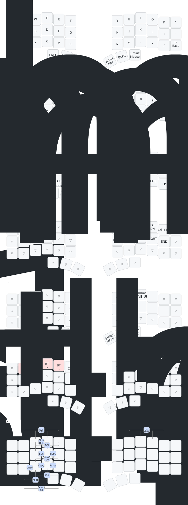

# floating cat's zmk-config

Based on [urob's zmk-config](https://github.com/urob/zmk-config) and [markstos Corne keyboard layout](https://mark.stosberg.com/markstos-corne-3x5-1-keyboard-layout/).

